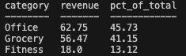

# sql-analytics-cookbook

A small, runnable SQLite project that demonstrates core SQL patterns used in entry-level data analysis work: filtering, joins, aggregation, and basic revenue calculations.

This repo includes:
- A simple “customers / orders / products” schema
- Seed data to populate the database
- Example query files that answer common business questions

## Project structure

- `schema/` — table definitions (DDL)
- `seed/` — insert statements to populate sample data
- `queries/` — example queries (SELECTs)
- `results/` — screenshots/exports of query outputs

## Quickstart

From the repo root:

```bash
# Create the SQLite database from scripts
sqlite3 cookbook.db < schema/01_create_tables.sql
sqlite3 cookbook.db < seed/02_insert_seed_data.sql

# Run a query
sqlite3 -header -column cookbook.db < queries/01_basic_select.sql

## Example output

Category share of revenue:

